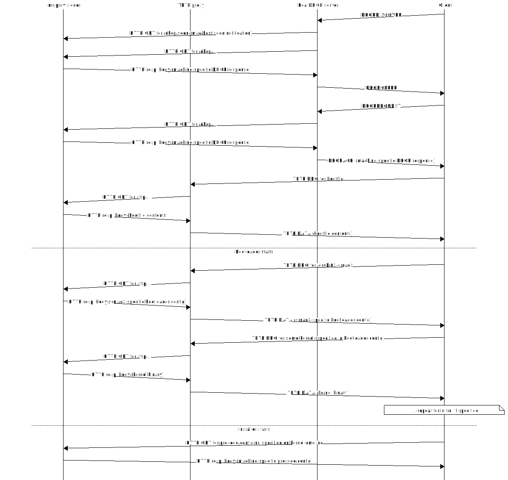
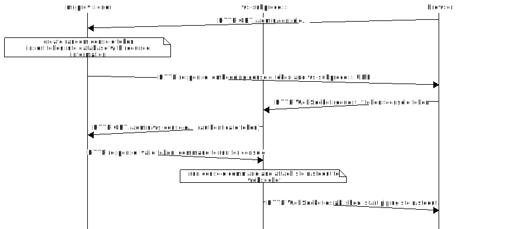

Design Overview
===============

This section will give an overview of how it all fits together, i.e. the roles of the dhcp/bootp server, tftp-http-proxy and ws-subprocess services. Still needs to be written.

.. image:: seqdiag/boot-flow-simple.svg
   :target: /_images/boot-flow-simple.svg

